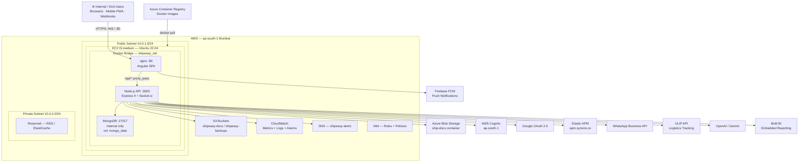
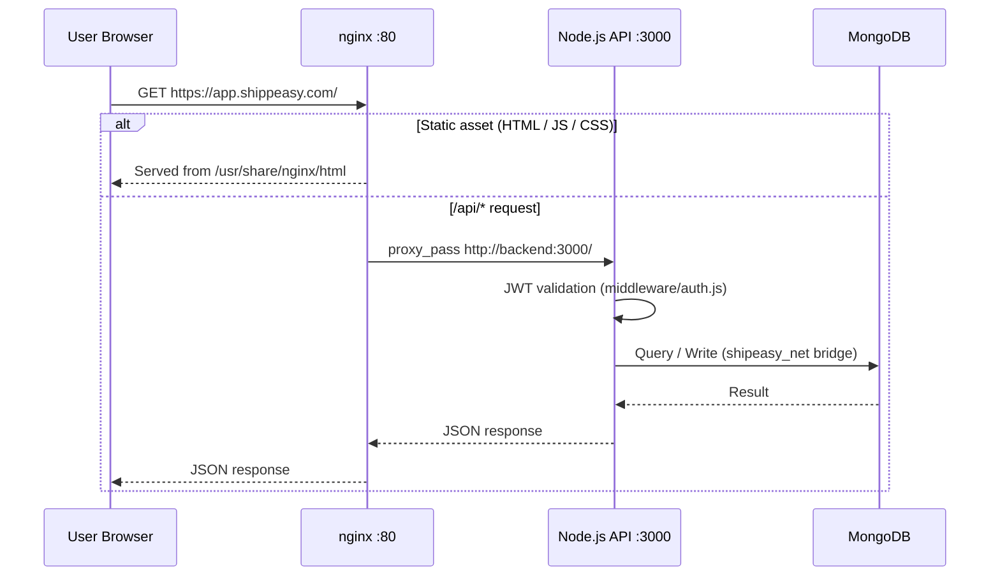

# Shippeasy SaaS — AWS Architecture Diagram

**Document Version:** 1.0  
**Classification:** Internal / Compliance  
**Last Updated:** March 2026

---

## 1. High-Level System Architecture

---

## 2. Request Flow (Runtime)

---

## 3. Container Architecture

| Container | Image | Exposed Port | Internal Port | Role |
|---|---|---|---|---|
| `shipeasy_frontend` | `<acr>.azurecr.io/shipeasy-frontend:<sha>` | 80 | 80 | nginx — Angular SPA + API proxy |
| `shipeasy_api` | `<acr>.azurecr.io/shipeasy-api:<sha>` | 3000 | 3000 | Express REST API + Socket.io |
| `shipeasy_mongo` | `mongo:6` | _none (internal)_ | 27017 | MongoDB data store |

---

## 4. Technology Stack Summary

| Layer | Technology | Version |
|---|---|---|
| Frontend Framework | Angular | 13 |
| Frontend UI | Angular Material, Bootstrap, NG-Zorro | — |
| Frontend Serving | nginx | stable-alpine |
| Backend Runtime | Node.js | 22 (LTS) |
| Backend Framework | Express | 4.x |
| Database | MongoDB | 6 |
| ORM | Mongoose | 8 |
| Real-time | Socket.io | 4.x |
| Auth | JWT + AWS Cognito + Google OAuth | — |
| Container Runtime | Docker Engine | 24+ |
| Orchestration | Docker Compose | v2 |
| CI Pipeline | Azure Pipelines | — |
| Container Registry | Azure Container Registry | — |
| Observability | Elastic APM + Winston | — |
| Cloud Platform | AWS EC2 (ap-south-1) | — |

---

## 5. Data Classification

| Data Type | Classification | Storage Location |
|---|---|---|
| User credentials | **Confidential** | MongoDB (hashed — bcrypt) |
| JWT tokens | **Confidential** | Client memory (not persisted) |
| Shipping documents | **Sensitive** | Azure Blob Storage |
| Application logs | Internal | EC2 Docker volume + CloudWatch |
| Database backups | **Confidential** | AWS S3 (encrypted) |
| Configuration secrets | **Confidential** | EC2 `.env` (not committed to repo) |
| API keys (third-party) | **Confidential** | ADO Variable Group (masked) |
