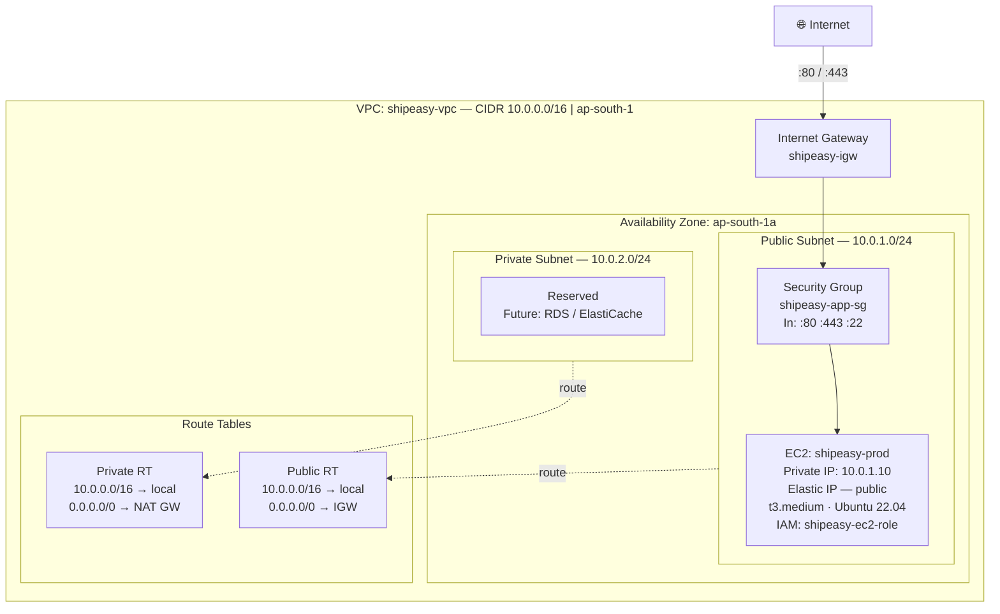
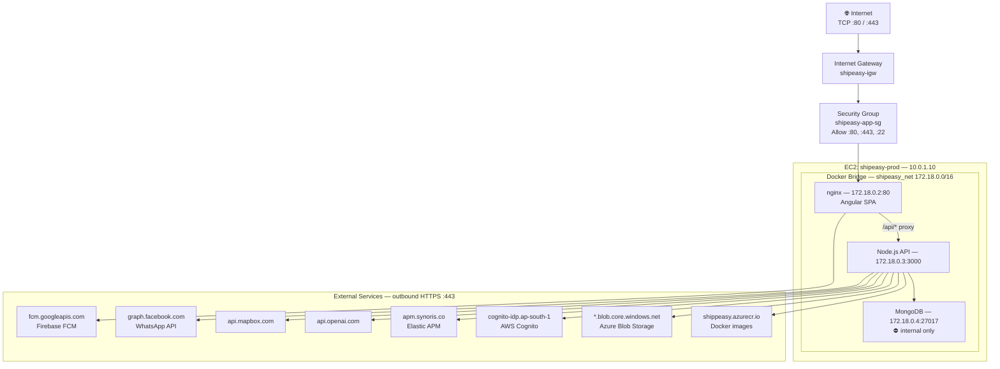

# Shippeasy SaaS — Network Diagram & VPC Layout

**Document Version:** 1.0  
**Classification:** Internal / Compliance  
**Last Updated:** March 2026

---

## 1. VPC Layout

---

## 2. Security Groups

### 2.1 shipeasy-app-sg (EC2 Application Server)

**Inbound Rules:**

| Rule # | Type | Protocol | Port Range | Source | Description |
|---|---|---|---|---|---|
| 100 | HTTP | TCP | 80 | 0.0.0.0/0, ::/0 | Public web traffic |
| 110 | HTTPS | TCP | 443 | 0.0.0.0/0, ::/0 | Public web traffic (TLS) |
| 120 | Custom TCP | TCP | 3000 | 10.0.0.0/16 | API — internal VPC only |
| 130 | SSH | TCP | 22 | Azure Pipelines CIDR | CI/CD deployment only |
| 140 | SSH | TCP | 22 | Admin IP (office) | Emergency admin access |

**Outbound Rules:**

| Rule # | Type | Protocol | Port Range | Destination | Description |
|---|---|---|---|---|---|
| 100 | All traffic | All | All | 0.0.0.0/0 | Outbound internet |

> **Note:** Port 27017 (MongoDB) is intentionally absent from all inbound security group rules. MongoDB is accessed exclusively through the Docker internal bridge network (`shipeasy_net`) — it is never reachable from the host network or internet.

---

## 3. Network Flow Diagram

---

## 4. DNS & TLS

| Record | Type | Value | Purpose |
|---|---|---|---|
| `app.shippeasy.com` | A | Elastic IP of EC2 | App entry point |
| `api.shippeasy.com` | A | Elastic IP of EC2 | API (if split domain used) |

**TLS Termination:** nginx (inside EC2 container)
- Certificate: Let's Encrypt (Certbot) or AWS Certificate Manager (ACM) if ALB is introduced
- Protocol: TLS 1.2 minimum, TLS 1.3 preferred
- Cipher Suite: ECDHE-RSA-AES256-GCM-SHA384 and modern equivalents

---

## 5. Firewall & Network ACL

| Layer | Tool | Policy |
|---|---|---|
| Perimeter | AWS Security Group | Stateful — only listed ports allowed |
| Host | UFW (Ubuntu Firewall) | Port 22, 80, 443 — all else DENY |
| Application | CORS policy in Express | Configurable per environment |
| Container | Docker bridge isolation | MongoDB not reachable from host |

---

## 6. Future Network Hardening (Recommended Roadmap)

| Item | Priority | Description |
|---|---|---|
| Add Application Load Balancer (ALB) | High | TLS offload at ALB; EC2 accepts only port 80 from ALB SG |
| Move MongoDB to private subnet | High | Dedicated EC2 or Amazon DocumentDB in private subnet |
| Add NAT Gateway | Medium | Allow private subnet outbound without public IP |
| Enable AWS WAF on ALB | High | Protect against OWASP Top 10 |
| Enable VPC Flow Logs | High | Log all VPC traffic to S3/CloudWatch for audit |
| Add AWS Shield Standard | Low | Free DDoS protection (auto-enabled on ALB/EC2) |
| Add second AZ (Multi-AZ) | Medium | Secondary EC2 for high availability |
