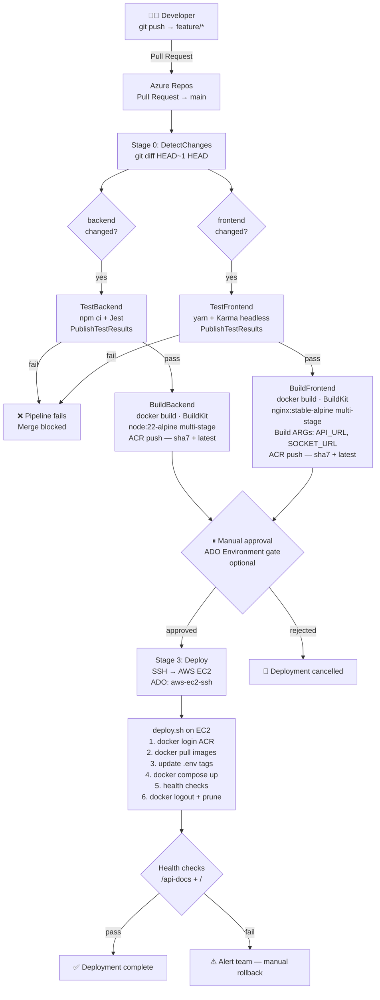
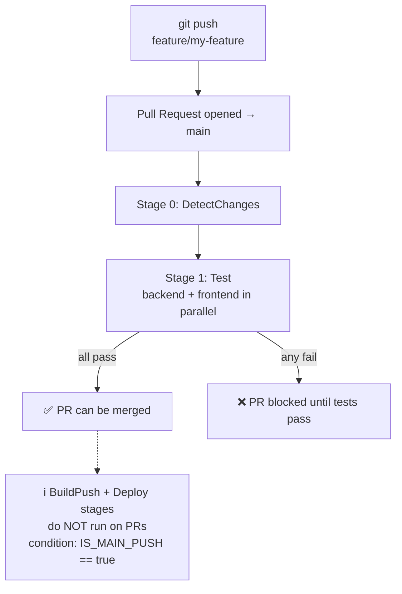
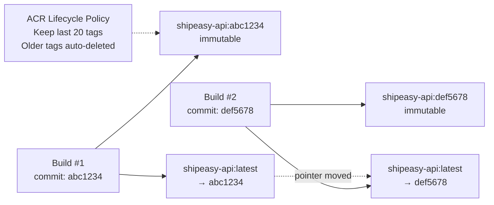
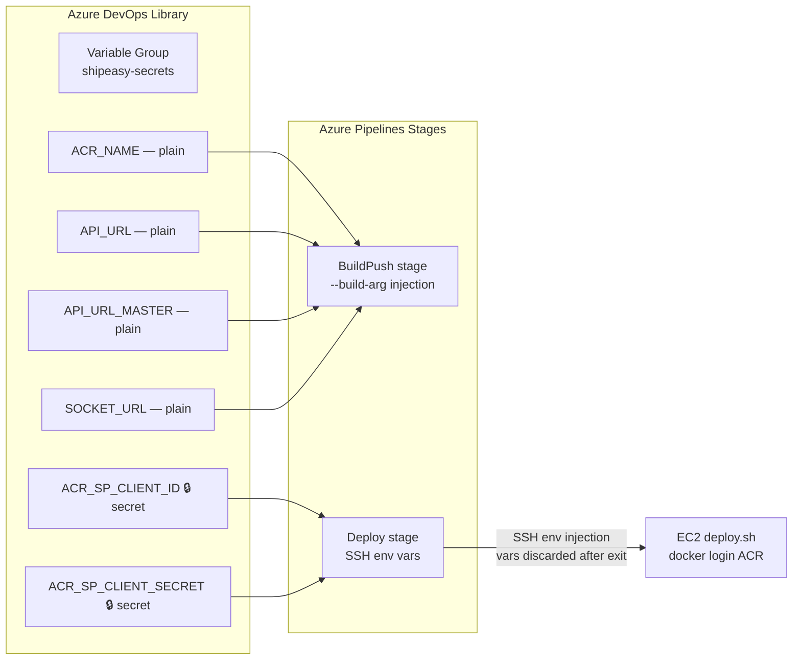

# Shippeasy SaaS — CI/CD Flow Diagram

**Document Version:** 1.0  
**Classification:** Internal  
**Last Updated:** March 2026

---

## 1. End-to-End CI/CD Pipeline



---

## 2. PR Validation Flow (no deploy)



---

## 3. Image Lifecycle in ACR



---

## 4. Rollback Procedure

If a deployment causes issues, roll back to the previous known-good SHA:

```bash
# On EC2 directly
cd ~/shipeasy

# Edit .env to set previous tag
PREVIOUS_BACKEND_TAG=abc1234   # previous good SHA
PREVIOUS_FRONTEND_TAG=abc1234

grep -v '^BACKEND_TAG\|^FRONTEND_TAG' .env > .env.tmp
echo "BACKEND_TAG=${PREVIOUS_BACKEND_TAG}" >> .env.tmp
echo "FRONTEND_TAG=${PREVIOUS_FRONTEND_TAG}" >> .env.tmp
mv .env.tmp .env

# Pull previous images (already in ACR)
docker pull shippeasy.azurecr.io/shipeasy-api:${PREVIOUS_BACKEND_TAG}
docker pull shippeasy.azurecr.io/shipeasy-frontend:${PREVIOUS_FRONTEND_TAG}

# Restart with previous images
docker compose up -d --no-build --no-deps --pull never backend frontend
```

Alternatively, re-run the ADO pipeline on a previous commit:
1. ADO → Pipelines → select pipeline
2. Click **Run pipeline** → **Advanced options** → select previous commit SHA

---

## 5. Pipeline Variables & Secrets Flow



---

## 6. Key Security Controls in the Pipeline

| Control | Implementation |
|---|---|
| No secrets in YAML | All secrets in ADO Variable Group (masked) |
| No secrets in container images | Build ARGs for non-secret config only; secrets injected at runtime via `.env` |
| Image immutability | Every image tagged with Git SHA — `latest` also set but SHA tag is used for deploy |
| Least-privilege registry access | ADO uses AcrPush, EC2 uses AcrPull |
| PR gate | Tests must pass before merge to main |
| Deploy approval | ADO Environment `production` with optional manual approval |
| Audit trail | Every pipeline run recorded in ADO with logs, timestamps, triggering user |
| Rollback ready | Previous SHA tags retained in ACR for 20+ builds |
